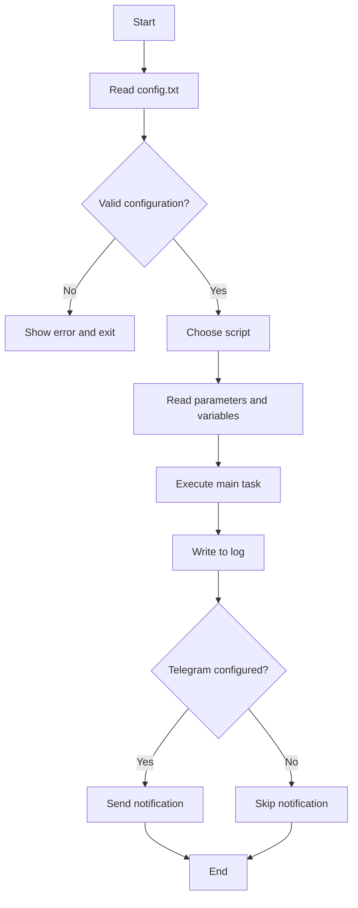
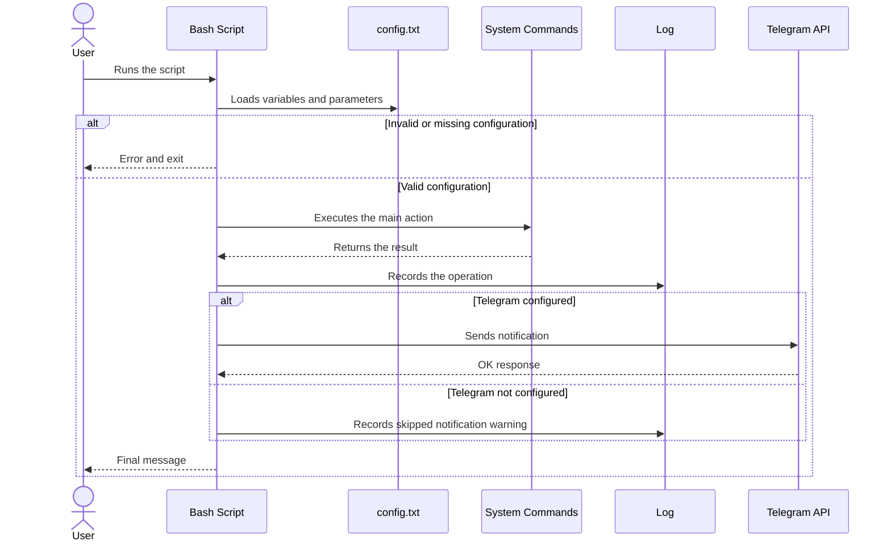

# Project Diagrams

This file summarizes the general execution order of the project and of a typical Bash script in the lab.

## Flowchart

### Flowchart sequence

1. The process starts when the user runs one of the project scripts.
2. The script finds and loads `config.txt` to obtain credentials, paths, and thresholds.
3. If the configuration does not exist or is invalid, the flow ends with an error.
4. If the configuration is valid, the script reads its own parameters and executes the main task.
5. After the task finishes, the result is recorded in the central log.
6. If Telegram is configured, the notification is sent; otherwise, evidence is left only in the log.
7. The flow ends.

## Sequence diagram

### Sequence diagram order

1. The user launches the script from the terminal or from another automated flow.
2. The script checks `config.txt` before performing any important action.
3. If the configuration is missing, it returns an error and exits without continuing.
4. If the configuration exists, the script calls the system utilities required by its function.
5. Once it obtains the result, it stores it in the central log.
6. If Telegram data is available, it sends the notification to the bot.
7. Finally, it returns the status to the user and completes the execution.

## Flow scope

This scheme applies to the common behavior of the project scripts: `usuarios.sh`, `respaldo.sh`, `monitoreo.sh`, `servicios.sh`, `remoto.sh`, `red.sh`, and `inventario.sh`.
